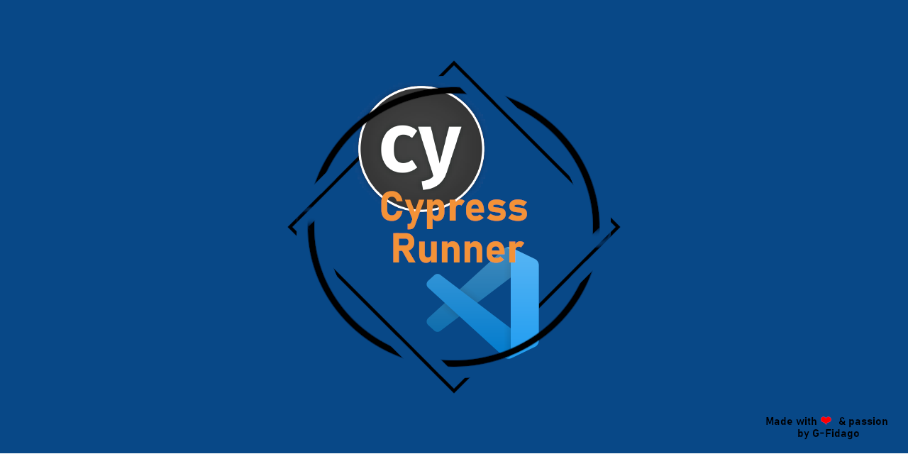

[![Contributors][contributors-shield]][contributors-url]
[![Forks][forks-shield]][forks-url]
[![Stargazers][stars-shield]][stars-url]
[![Issues][issues-shield]][issues-url]
[![MIT License][license-shield]][license-url]
[![LinkedIn][linkedin-shield]][linkedin-url]

 

    

  

    Welcome to Cypress Runner Docs!
     
    ¯\_(ツ)_/¯
     
    <a href="https://github.com/G-Fidalgo/cypress-runner"><strong>Explore the docs »</strong></a>
     
     
    <a href="https://github.com/G-Fidalgo/cypress-runner/issues">Report Bug</a>
    ·
    <a href="https://github.com/G-Fidalgo/cypress-runner/issues">Request Feature</a>
  

<!-- TABLE OF CONTENTS -->

  
Table of Contents

  <ol>
    <li><a href="#features">Features</a></li>
    <li><a href="#extension-settings">Extension Settings</a></li>
    <li><a href="#contributing">Contributing</a></li>
    <li><a href="#acknowledgments">Acknowledgments</a></li>
  </ol>

## Features

Simple way to run a single (or multiple) Cypress tests from Code Lens, automatically adding or removing .only to the single test or block you would like to run

Also available the possibility to remove all .only added from a single button on status bar

(<a href="#top">🔠Back to top ğŸ”</a>)

## Extension Settings

Cypress Runner will work out of the box, with a valid Cypress config.  
If you have a custom setup use the following options to configure Cypress Runner:

| Command                                      | Description                                                                                          |
| -------------------------------------------- | ---------------------------------------------------------------------------------------------------- |
| cypressrunner.templates                      | Array to control extension behaviour over codeLens                                                   |
| cypressrunner.removeAllOnlyButton            |                                                                                                      |
| cypressrunner.configPath                     | Cypress config path (relative to ${workFolder} e.g. cypress-config.json)                             |
| cypressrunner.cypressPath                    | Absolute path to cypress bin file (e.g. /usr/lib/node_modules/cypress/bin/cypress.js)                |
| cypressrunner.projectPath                    |                                                                                                      |
| cypressrunner.runOptions                     |                                                                                                      |
| cypressrunner.cypressCommand                 | Define an alternative Cypress command (e.g. for Create React App and similar abstractions)           |
| cypressrunner.codeLensSelector               | CodeLens will be shown on files matching this pattern (default \*_/_.{cy,test,spec}.{js,jsx,ts,tsx}) |
| cypressrunner.changeDirectoryToWorkspaceRoot |                                                                                                      |

(<a href="#top">🔠Back to top ğŸ”</a>)

## Contributing

-   Fix Remove All Only button

-   Add debug Code Lens

-   Add arguments generation on command build

(<a href="#top">🔠Back to top ğŸ”</a>)

## Acknowledgments

Based on VsCode extensions:

-   [vscode-jest-runner](https://github.com/firsttris/vscode-jest-runner)
-   [add-only](https://github.com/ub1que/add-only)

And special thanks to @[WanManolo](https://github.com/WanManolo) as instigator of this project

<a href="https://github.com/WanManolo">
 
 
@WanManolo

</a>

Made with love & passion 🚀

(<a href="#top">🔠Back to top ğŸ”</a>)

<!-- MARKDOWN LINKS & IMAGES -->
<!-- https://www.markdownguide.org/basic-syntax/#reference-style-links -->

[contributors-shield]: https://img.shields.io/github/contributors/G-Fidalgo/cypress-runner?style=for-the-badge
[contributors-url]: https://github.com/G-Fidalgo/cypress-runner/graphs/contributors
[forks-shield]: https://img.shields.io/github/forks/G-Fidalgo/cypress-runner?style=for-the-badge
[forks-url]: https://github.com/G-Fidalgo/cypress-runner/network/members
[stars-shield]: https://img.shields.io/github/stars/G-Fidalgo/cypress-runner?style=for-the-badge
[stars-url]: https://github.com/G-Fidalgo/cypress-runner/stargazers
[issues-shield]: https://img.shields.io/github/issues/G-Fidalgo/cypress-runner?style=for-the-badge
[issues-url]: https://github.com/G-Fidalgo/cypress-runner/issues
[license-shield]: https://img.shields.io/github/license/G-Fidalgo/cypress-runner?style=for-the-badge
[license-url]: https://github.com/G-Fidalgo/cypress-runner/blob/main/LICENSE
[linkedin-shield]: https://img.shields.io/badge/-LinkedIn-black.svg?style=for-the-badge&logo=linkedin&colorB=555
[linkedin-url]: https://www.linkedin.com/in/gonzalo-fidalgo-martinez-merello/
